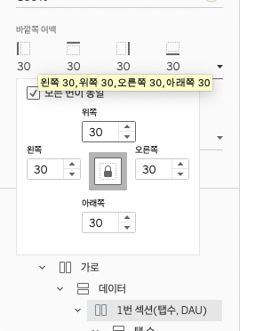

태블로 대시보드 꿀팁을 하나 적고 갑니다..

태블로를 예쁘게 꾸미다 보면 iOS 스택뷰 사용하듯이 이렇게 가로 세로 뷰를 많이 사용하게 되는데요!

이렇게 가로 세로 뷰를 여러개 사용하다보면 추가하려는 곳에 잘 추가가 되지 않을 때가 많아요ㅠㅠ

그럴 때에는  가로 세로 여백과 배경화면을 설정하면 다른 뷰들과 분리가 되어서 추가하기 편해집니다!

  

추가로 각 뷰 별로 이름을 따로 지정도 가능합니다!

  